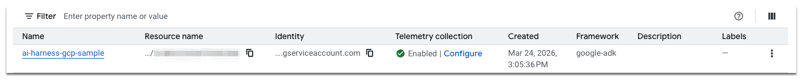
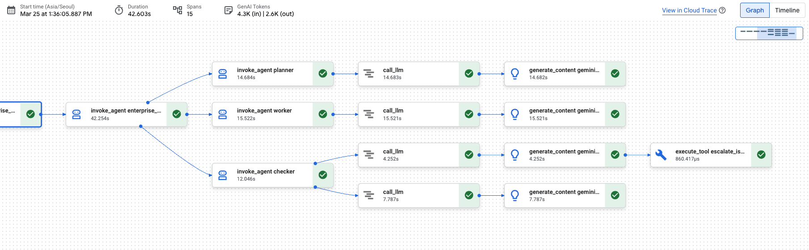
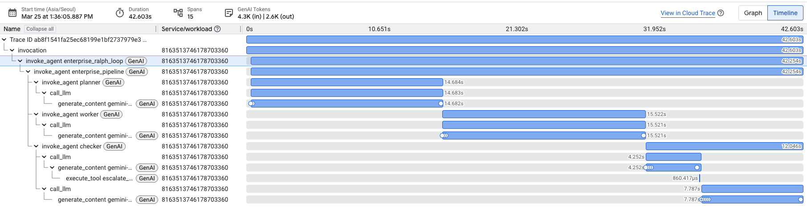
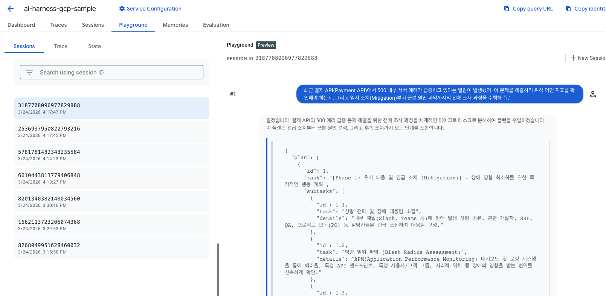

# Enterprise AI Agent Harness Sample on Google Cloud

이 프로젝트는 **Google AI 에이전트 아키텍처 및 엔터프라이즈 개발 가이드**를 기반으로 구축된 샘플 에이전트 시스템입니다.  
기업 환경에서 확장 가능하고 안전한 AI 에이전트 운영을 위한 표준 구조와 검증된 배포 패턴을 제공합니다.

---

## 💡 1. 핵심 기술 컨셉

### 1.1. 모델 하네스 (Model Harness)
단순한 LLM 호출 코드가 아니라 모델을 안전하게 감싸는 **소프트웨어 비계(Scaffolding)** 역할을 합니다.
- **인터페이스 격리**: 하네스는 외부 시스템과의 통신 규격을 고정합니다. 내부 모델이나 프롬프트가 변경되어도 연동 규격은 일정하게 유지됩니다.
- **리전 디커플링 (Region Decoupling)**: 인프라는 특정 리전(예: `us-central1`)에 배포하되, 최신 모델(Gemini 3 Preview)은 `global` 엔드포인트를 통해 호출하도록 환경 변수 레벨에서 설정합니다.

### 1.2. 자율 실행 루프 (Ralph Loop)
- **Planner → Worker → Checker**: 전체 목표를 마이크로 태스크로 쪼개고, 실행 후 품질을 검증하여 다음 단계로 나아가는 자기 완결적 구조를 가집니다.
- **ZDR (Zero-Downtime Resilience)**: 상태 영속화 로직을 통해 컨테이너 재시작 시에도 마지막 작업 시점부터 복구가 가능합니다.

---

## 🏛️ 2. 아키텍처 레이어

- **Orchestration Layer**: `agents/agent.py`, `agents/ralph_loop.py` (ADK Native Loop & ZDR)
- **Harness Layer**: `agents/harness.py` (GenAI SDK Abstraction)
- **Security Layer**: `tools/policy_engine.py` (SRE Interception & Validation)

---

## 📁 3. 디렉토리 구조

```text
/ai-harness-gcp-sample/
├── .agent/              # 에이전트 개발 협업 및 계획 컨텍스트
├── agents/              # 핵심 로직 (Ralph Loop, Harness)
│   ├── .env             # [비공개] 로컬 테스트용 환경 변수 (사용자 생성)
│   ├── agent.py         # ADK 에이전트 정의 (Entry Point)
│   ├── harness.py       # 모델 호출 추상화 클래스
│   └── ralph_loop.py    # 상태 관리 및 ZDR 로직
├── ci-cd/               # 배포 자동화
│   ├── cloudbuild.yaml  # CI/CD 파이프라인
│   └── package_for_terraform.sh # 아티팩트 빌드 스크립트
├── eval/                # 평가 (Golden Dataset)
│   └── run_eval.py
├── infra/               # Terraform IaC 정의
│   ├── main.tf          # Terraform 프로비저닝 스크립트
│   └── memory_bank_config.py # 메모리 뱅크 설정
├── policies/            # 거버넌스 및 보안 정책 (Policy Engine 룰셋 등)
├── prompts/             # 시스템 인스트럭션 및 프롬프트 템플릿
│   └── system_instruction.txt
├── tools/               # 도구 연동 및 보안 (MCP, Policy)
│   ├── grounding.py     # RAG 연동
│   ├── mcp_client.py    # Remote MCP 연동
│   └── policy_engine.py # SRE Interception Layer
├── .env.example         # 환경 변수 템플릿
├── .gitignore           # Git 제외 규칙
├── pyproject.toml       # 패키지 빌드 설정
├── requirements.txt     # Python 의존성 목록
└── README.md            # 본 가이드
```

---

## 🚀 4. 배포 및 테스트 가이드

사용자의 상황에 따라 세 가지 배포 방식을 제공합니다. 시작하기 전에 프로젝트를 클론하고 의존성을 설치하세요.




```bash
# 1. 저장소 클론 및 이동
git clone https://github.com/hajekim/sample-agent-harness-on-gcp.git
cd ai-harness-gcp-sample

# 2. 환경 변수 세팅 (로컬 테스트용)
# .env.example을 복사하여 비공개 환경 변수 파일(agents/.env)을 생성합니다.
cp .env.example agents/.env

# 📝 복사 후 agents/.env 파일을 열고 다음 값을 본인의 환경에 맞게 수정하세요:
# - GOOGLE_CLOUD_PROJECT: "your-project-id-here" 를 실제 GCP 프로젝트 ID로 변경합니다.
# - GOOGLE_CLOUD_LOCATION=global 은 Gemini 3 모델 접근을 위해 그대로 유지합니다.

# 3. 가상환경 설정 및 의존성 설치
python3 -m venv .venv
source .venv/bin/activate
pip install -e .

# 4. 공통 환경 변수 설정
export PROJECT_ID="YOUR_PROJECT_ID"
export REGION="us-central1"
```

### 방식 A. ADK CLI 배포 - 로컬 개발 및 퀵 테스트
가장 빠르고 간편한 방법으로, 개발자가 로컬에서 즉시 에이전트를 클라우드에 띄워 테스트할 때 적합합니다.

*   **특징**: ADK가 내부적으로 패키징과 프로비저닝을 한 번에 수행합니다.
    ```bash
    adk deploy agent_engine agents \
      --project $PROJECT_ID \
      --region $REGION \
      --display_name "harness-quick-test" \
      --validate-agent-import
    ```

### 방식 B. Terraform GitOps 배포 - 엔터프라이즈 표준 ⭐️
인프라의 변경 사항을 코드로 관리(IaC)하고, 빌드 아티팩트(Golden Artifact)의 불변성을 보장하는 방식입니다. 실제 운영 환경에 가장 권장됩니다.

*   **특징**: 빌드(CI)와 배포(CD)가 분리됩니다. Terraform이 환경 변수(`global` 리전 등)를 안전하게 주입합니다.
    ```bash
    # 1단계: 아티팩트 빌드 (ADK 래퍼 서버 포함)
    chmod +x ci-cd/package_for_terraform.sh
    ./ci-cd/package_for_terraform.sh

    # 2단계: Terraform 프로비저닝
    cd infra
    terraform init
    terraform apply -var="project_id=$PROJECT_ID" -var="region=$REGION"
    ```

### 방식 C. Cloud Build 자동 배포 - 완전 자동화
GitHub 푸시와 연동하여 테스트, 평가, 배포를 한 번에 수행하는 파이프라인입니다.

*   **특징**: `eval/run_eval.py`를 통한 품질 검증을 통과해야만 배포가 진행됩니다.
*   **설정**:
    1. Google Cloud Console에서 Cloud Build 트리거를 생성합니다.
    2. 저장소의 `ci-cd/cloudbuild.yaml`을 설정 파일로 지정합니다.
    3. `${_PROJECT_ID}` 대치 변수를 설정합니다.

---

## 📊 5. 배포 방식 비교

| 구분 | ADK CLI (방식 A) | Terraform (방식 B) | Cloud Build (방식 C) |
| :--- | :--- | :--- | :--- |
| **추천 용도** | 개인 개발, 프로토타이핑 | 인프라 거버넌스, 운영 환경 | 지속적 통합 및 자동 배포 |
| **빌드 주체** | ADK 내부 엔진 | `package_for_terraform.sh` | Cloud Build Runner |
| **장점** | 매우 빠르고 단순함 | 인프라 상태 추적 및 복구 용이 | 사람의 개입 없는 자동화 |
| **단점** | 인프라 이력 관리가 어려움 | 패키징 단계를 직접 관리해야 함 | 트리거 설정 등 초기 비용 발생 |

---

## 🔍 6. Observability & Telemetry




에이전트의 상태를 모니터링하기 위해 **`agents/.env`** 파일에 다음 설정을 적용해야 합니다. (제공된 `.env.example` 파일을 복사하여 사용하세요.)

- **`GOOGLE_CLOUD_AGENT_ENGINE_ENABLE_TELEMETRY=true`**: OpenTelemetry 기반 트레이스 수집 활성화.
- **`OTEL_INSTRUMENTATION_GENAI_CAPTURE_MESSAGE_CONTENT=true`**: 보안상 숨겨지는 상세 프롬프트 및 응답 가시성 확보.

💡 **참고**: Terraform 배포 시에는 `infra/main.tf`의 `deployment_spec.env` 블록에서 위 설정들이 인프라 수준으로 자동 주입되도록 구성되어 있습니다.

---

## 🤖 7. 테스트 시나리오

배포 완료 후, Vertex AI Console 또는 API를 통해 에이전트에게 다음 작업을 지시해 보세요.


1. **SRE 장애 조사**: "결제 API의 500 에러 원인을 분석하고 조치 계획을 세워줘."
2. **아키텍처 설계**: "기존 DB를 Spanner로 옮기기 위한 3단계 전략을 짜고 검증해줘."
3. **자율 검증**: "보안 안내문을 작성하되 특정 키워드가 누락되면 스스로 수정해서 완성해줘."


### 시나리오 A: SRE 장애 조사 - 자동화된 문제 해결
"최근 결제 API(Payment API)에서 500 내부 서버 에러가 급증하고 있다는 알람이 발생했어. 이 문제를 해결하기 위해 어떤 지표를 확인해야 하는지, 그리고 임시 조치(Mitigation)부터 근본 원인 파악까지의 전체 조사 과정을 수행해 줘."
> **관전 포인트**: Planner가 조사 단계를 나누고, Worker가 각 단계의 해결책을 추론하며, Checker가 계획이 완수되었는지 검증할 때까지 루프를 돕니다. 도구 호출 시 파괴적 명령이 섞여 있다면 `Policy Engine`이 이를 인터셉트(차단)합니다.

### 시나리오 B: 엔터프라이즈 아키텍처 플래닝
"현재 온프레미스에 있는 레거시 모놀리식 데이터베이스를 Google Cloud Spanner로 마이그레이션하려고 해. 다운타임을 최소화하기 위한 마이그레이션 전략을 3단계로 나누어 세우고 검증해 줘."
> **관전 포인트**: 매우 거대한 목표를 받았을 때, 에이전트가 어떻게 마이크로 태스크 단위로 쪼개어 단계별로 실행하고 결과물을 취합하는지 관찰합니다.

### 시나리오 C: 자기 검증(Self-Correction) 및 가드레일 테스트
"엔터프라이즈 AI 보안 가이드라인에 대한 짧은 안내문을 작성해줘. 단, 반드시 '환각 방지', '데이터 암호화', '접근 통제' 이 3가지 키워드가 모두 포함되어야 해. 만약 하나라도 빠졌다면 다시 작성해."
> **관전 포인트**: Worker가 초안을 작성하면, Checker 에이전트가 3가지 키워드가 모두 있는지 평가합니다. 누락되었다면 Checker가 루프 종료를 거부하고, Worker에게 다시 작성하도록 지시하는 **'무한 루프 방지 및 검증(Guardrail)'** 사이클을 확인할 수 있습니다.
